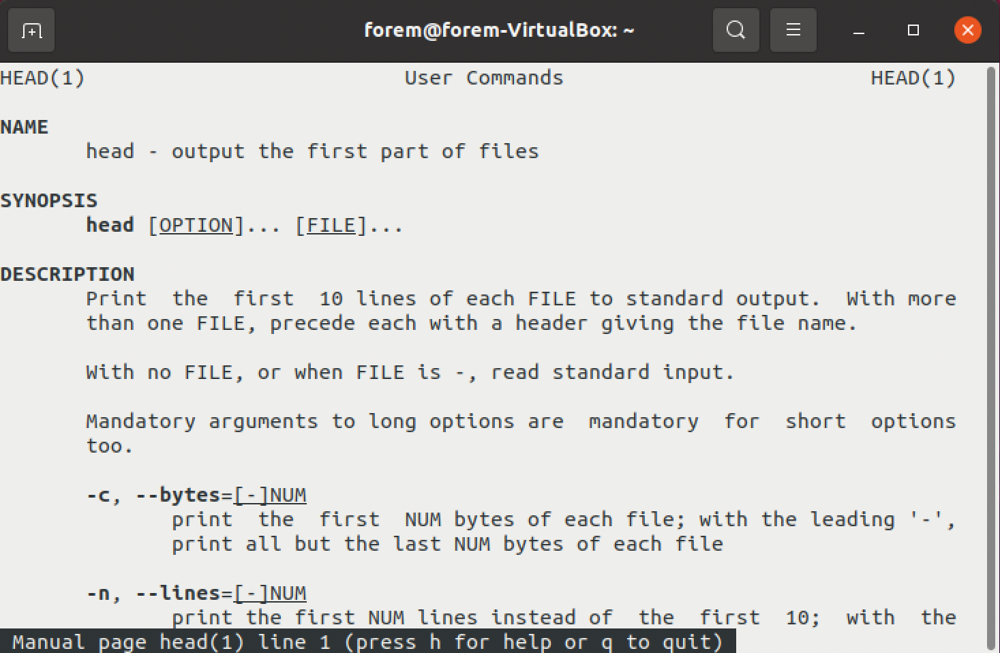

```{r setup, include=FALSE}
hook_chunk = knitr::knit_hooks$get('chunk')

knitr::knit_hooks$set(chunk = function(x, options) {
  regular_output = hook_chunk(x, options)
  if (isTRUE(options$addspacebeforechunck)) 
    sprintf("\\vspace{3pt}\n %s\n \\vspace{3pt}\n", regular_output)
  else
    regular_output
})
knitr::opts_chunk$set(echo = TRUE, prompt = FALSE, eval = FALSE, addspacebeforechunck = TRUE)
options(prompt="$ ")
```

## Preamble

For this first lesson, we will adopt the 'infant swimming' technique: it doesn't matter if you don't know the command line yet, you are going to write some code and hopefully get results ;-) ... The deep understanding of the code will be revealed later on.

The `$` symbol at the beginning of the lines represents the *prompt* you have at the command line, i.e. the place where the cursor is located and ready to accept any characters you type. In the case of your terminal, some information are preceding the `$`. We will see later what they are and how we can customize them. Note that depending on your system, the prompt could differ and the `$` replaced by another character such as `>`.

At the end of each line, you press `enter`, which sends the string to the *command line interpreter*, here the `bash` program.

In the following tutorial, some lines will start with a `#`. It means that the line is just a *comment*. You don't need to write it, but even if you did, it won't be interpreted.

### Important warnings

1. If something goes wrong, it is probably because you typed something wrong. Remember that every single character that you type will be interpreted and could have a special meaning depending on the context or position in the command line. This is especialy the case for **blank spaces** or special characters such as but not limited to `][)(}{|;&~.*$#!`. **Follow very carefully what is written in the tutorial**.
2. Some commands will use special codes starting with `!`, for example ...`cd !#:2`. These special structures are related to the bash *history expansion* feature that will be explained in details later. This feature is really worth using because it improves greatly the ergonomy of the command line. That is the reason why I have tried to demonstrate its use as much as possible, along the exercise. However, since some of the codes really depend on the actual sequence the commands are entered, they may not work as expected if for some reason the flow of your commands differs slightly from what is proposed in the tutorial. So, you will always find the complete command line as a comment starting with `# shortcut for ...`

### Context

In this tutorial, you will retrieve taxonomic data from the NCBI repository, reorganize and filter them with the end goal being to collect information (taxids and names) on all *order* and *family* ranks and organize them as a 3-column table in a .csv formatted file. 

## Let's go...

### Additional configuration

Open the shell configuration file `~/.bashrc` with the text editor *nano*...

```{bash}
$ nano ~/.bashrc
```

... and add 2 lines at the end.

```{bash}
# add these lines at the end of the file (scroll down with the mouse or arrow key)
PROMPT_COMMAND='history -a'
shopt -s histverify
# Press Ctrl-x to quit, O or Y to accept changes and enter to validate the 
# path to the file to be saved.

# Apply the changes
$ source ~/.bashrc

# If you did that correctly, the next command should display "history -a"
$ echo $PROMPT_COMMAND
```

### Organize your workspace

```{bash}
$ cd ~
$ pwd
```

The last command should produce an output like `/home/your_login_name`

```{bash}
$ mkdir -p linux/1st_lesson && cd !#:2
# shortcut for mkdir -p linux/1st_lesson && cd linux/1st_lesson
$ pwd
```

When you press `enter`, the part `!#:2` should be replaced by `linux/1st_lesson` or the exact string your entered just after `mkdir` and `&&`.

### Download taxonomic data 

```{bash}
$ wget "ftp://ftp.ncbi.nlm.nih.gov/pub/taxonomy/taxdump.tar.gz"

# Here is an alternative to wget that exists in both Linux and MacOS:
# curl -O ftp://ftp.ncbi.nlm.nih.gov/pub/taxonomy/taxdump.tar.gz

# In the next command, stop after typing 'tax' and press the tabulation key... 
# That's a first example of auto-complete capabilities of the shell. 
# In the following, this {TAB} notation will invite you to use this great feature 
# as often as possible
# !!! if {TAB} produces no result or not the expected result, then it means that
# what you typed before was not correct (misspelling, file does not exist at 
# this location, etc...) !!!
$ tar -xzf tax{TAB}
$ ls -l
$ head na{TAB} no{TAB}
```

As you probably understood, the last command, `head`, displayed the first lines of each files, giving you a hint about their content. The next command will help you to better understand what they are.

```{bash}
$ less r{TAB}
# Should open readme.txt
# Scroll with mouse/tab gestures or arrows and quit with 'q'
```

One of the files contains data linking *taxids* with names (of species, genus, families, etc...) and the other one data linking *taxids* with taxonomic ranks. The objective is to retrieve the taxids and names for the 'family' and 'order' ranks. A new file containing 3 "columns" (taxids, ranks and names) will be created. But first, let's do some cleaning up to remove the files not needed.

```{bash}
# Start by doing some cleaning, you only need names.dmp and nodes.dmp. The other files
# can be deleted
$ ls -l

# Use the up arrow (and down arrow) to navigate in the history of the commands you typed...
# By doing this, you can modify the last command and add a pattern to filter the output
$ ls -l n[ao]*.dmp

# Use again the up arrow and edit the last command rather than re-typing everything...
$ ls -l !(n[ao]*.dmp)
$ rm !!:$
# shortcut for rm !(n[ao]*.dmp)
```

### Data processing

In the next series of commands, you will process the data contained in *names.dmp* by using several commands acting sequentially. You will build what is called a *pipe* by adding one command at a time (separated by the pipe character `|`) and evaluating each intermediate result.

To make it easy, remember to use the up arrow key to display the last executed commands and simply adding the new command at the end.

````{bash}
$ head -n40 na{TAB}
$ head -n40 names.dmp | grep 'scientific name'
$ head -n40 names.dmp | grep 'scientific name' | cat -T
$ head -n40 names.dmp | grep 'scientific name' | tr -d '\t'
$ head -n40 names.dmp | grep 'scientific name' | tr -d '\t' | cut -d '|' -f 1,2

# If you press 'enter' after a pipe symbol, the command is not executed because
# bash 'knows' it is not finished. The prompt changes to indicate that you are
# in a multiline command. You can test it if you like, but it is not necessary, 
# I only use it here to avoid page overflow.
$ head -n40 names.dmp | grep 'scientific name' | tr -d '\t' | cut -d '|' -f 1,2 | 
> sort -t '|' -k 1b,1

# Save the result in a new file
$ head -n40 names.dmp | grep 'scientific name' | tr -d '\t' | cut -d '|' -f 1,2 | 
> sort -t '|' -k 1b,1 > file1

# Have a look at what you get
$ ls -lh
$ wc -l f{TAB}

# Now, let's do it on the whole file
$ cat !head:2*
# shortcut for cat names.dmp | grep 'scientific name' | tr -d '\t' | 
#              cut -d '|' -f 1,2 | sort -t '|' -k 1b,1 > file1
$ ls -lh
$ wc -l f{TAB}
```

From the nodes.dmp file, you will filter the lines related to *family* and *order* ranks (strictly!) and create a new file containing only taxid and rank columns.

```{bash}
$ head -n10 no{TAB}
$ head -n10 nodes.dmp | tr -d '\t'
$ head -n10 nodes.dmp | tr -d '\t' | grep -E '\|family|\|order'
$ ^10^250^ 
# shortcut for head -n250 nodes.dmp | grep -E '\|family|\|order'

$ head -n250 nodes.dmp | tr -d '\t' | grep -E '\|family|\|order' | cut -d '|' -f 1,3
$ head -n250 nodes.dmp | tr -d '\t' | grep -E '\|family|\|order' | cut -d '|' -f 1,3 | 
> sort -t '|' -k 1b,1

# If the result is ok, apply it on the whole nodes.dmp file and save it in a new file
$ cat !!:2* > file2
# shortcut for cat nodes.dmp | grep -E '\|family|\|order' | cut -d '|' -f 1,3 | 
# > sort -t '|' -k 1b,1
$ ls -lh
$ wc -l f{TAB}2
```

Check quickly the result in both new files and make the join.

```{bash}
$ tail f*
$ join -t '|' -o '1.1 2.2 1.2' file* | head

# Some ordering
$ !!:- sort -t '|' -nk1 
# shortcut for join -t '|' -o '1.1 2.2 1.2' file* | sort -t '|' -nk1

# OK ? So let's create the file
$ !! > taxonomy
# shortcut for join -t '|' -o '1.1 2.2 1.2' file* | sort -t '|' -nk1 > taxonomy

$ ls -lh
$ wc -l t{TAB}
# t{TAB} should produce taxonomy

# Add column names
# This is a multiline command. You must press enter after 1i\, the prompt 
# changes to '>', you type the text and press enter again before closing the quote
# end giving the filename argument
$ sed -i -e '1i\
> taxid|rank|name
> ' t{TAB}
```

Now, consider you want to have a french version of this taxonomy file and to share those files (english or french) with colleagues who are using standard office software. You will do the translation of *order* to *ordre* and *family* to *famille* and change the field separator from `|` to `,` or `;` which are the standard separators of *.csv* files recognized in common spreadsheet tools.

```{bash}
# The french version...
$ echo "taxid,rang,nom" > taxonomy_fr.csv
$ tail -n+2 t{TAB} >> !!:$
$ sed -i -e 's/|/,/g' !!:$
$ sed -i -e 's/order/ordre/' !!:$
$ ^order/ordre^family/famille^
# shortcut for sed -i 's/family/famille/' taxonomy_fr.csv

# The english version as .csv file
$ sed -i -e 's/|/,/g' t{TAB}
$ mv t{TAB} t{TAB}_en.csv
```

### Keep a log of your work

Every command entered in the terminal is saved automatically in a file: `~/.bash_history`.

```{bash}
# Save your work to a new file
$ cat ~/.bash_h{TAB} > lesson1_history
```

This history of commands you saved is like your bioinformatic 'lab notebook'. To make it really useful as a lab notebook, you should annotate it so you will be able to easily remember after days, weeks, months or even years what was the logic behind your code.

### Anatomy of a command

To improve your understanding of what the codes you wrote do, I ask you to search for information about each command and to annotate your `lesson1_history` file with those information. Fortunately, getting information about commands is quite easy in the shell: several tools exists such as the `man`, `help` or `info` commands or the `--help` option when available. Sometimes, all of those solutions may not be available for some commands but at least one of them will certainly work.

Let's take the example of `head`:

```{bash}
$ man head
$ info head
$ help head
$ head --help
```

Each of those tools displays similar information but presented slightly differently depending on the tool. Let's focus on the `man head` output.



The information is structured in a few sections:

- the NAME of the command with a short description of what it does.
- the SYNOPSIS, which describes the anatomy of the command, i.e. the exact way it **must** be used. As you may see, in the case of `head`, the command itself is followed by arguments which, in this case, are (facultative) options and (facultative) file names. Here are the rules  that applied in the synopsis:
  - the arguments surrounded by the symbols `<` and `>` are mandatory.
  - arguments enclosed in square brackets `[]` are optional.
  - when groups of arguments are separated by `|`, they cannot coexist.
  - `...` means that the command accepts a list of arguments (elements separated by a space)
- the full DESCRIPTION of the command followed by a list of options which can be used to modulate the way the command works
  - options start with one or two dashes. Many of the options require an additional value next to them. In this case, the option is followed by the name of the argument (usually underlined, eg [--lines=NUM]). The short *single-dash* form of the options may be used with or without a space between it and its value, although a space is a recommended separator. The long *double-dash* form requires a space between it and its value. Short version options that don't need any additional values can be can be grouped such as in `ls -lh` which is equivalent to `ls -l -h`.  

Remember that every character counts, whether visible or invisible: case (lowercase or uppercase) is important and spaces frequently have important meaning depending on the context (for example, in the case of the argument list mentioned above). This will have particular consequences on the treatment of the names of files or directories which contain spaces (To be avoided in general!).

### Exercise

Edit your history file (`lesson1_history` or whatever file you created). You can use the `nano` editor but you may find it more convenient to use an editor from the graphical interface such as `gedit`...

```{bash}
# note the & at the end of the command
$ gedit lesson1_history &

# if you prefer not to quit the terminal
$ nano lesson1_history
```

... and add comment just before every new command to explain briefly what they do, with a special focus on the options used. Here is an example :

```{bash}
# head displays the first lines of files
#   -n followed by a number defines the number of lines to be displayed
#   the last argument is the name of the file on which the command is applied
# grep do something else...
head -n40 names.dmp | grep 'scientific name'
```

